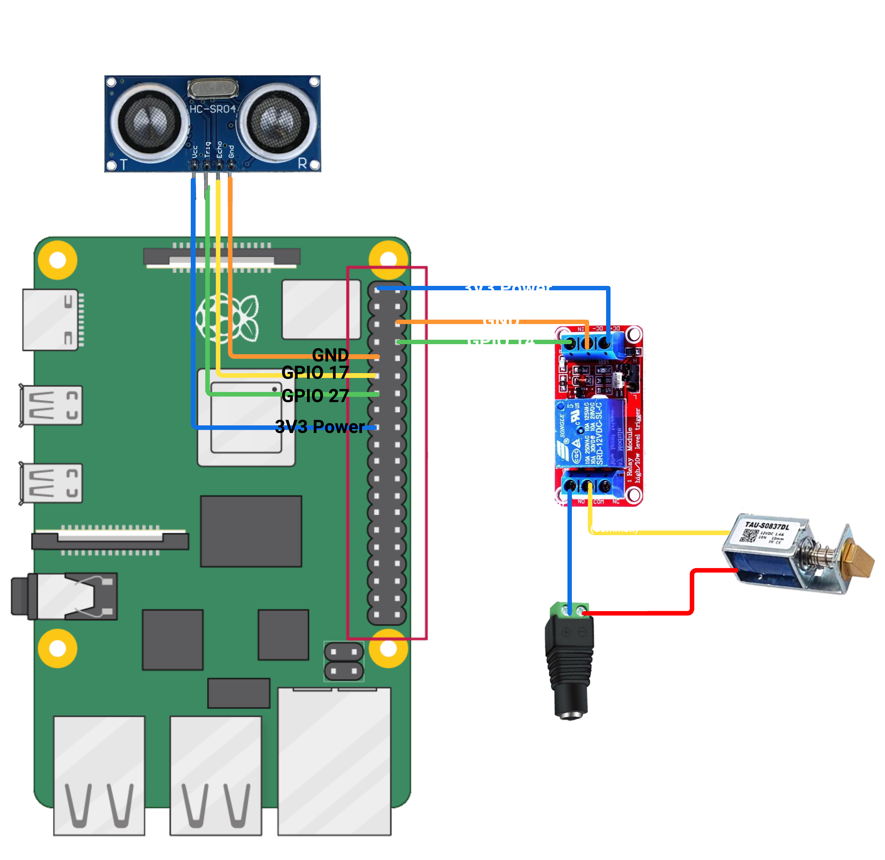

# Smart Door Lock System

A Raspberry Pi-based electronic door lock system using facial recognition, wake word detection, and ultrasonic presence sensing for enhanced security and convenience.

## Features

- **Low-power idle mode**: System runs in energy-efficient state while waiting for potential users
- **Presence detection**: Ultrasonic sensor detects when someone approaches within 1 meter
- **Wake word activation**: Custom trained wake word model activates the system with voice commands
- **Facial recognition**: Uses Siamese network architecture for secure biometric authentication
- **Automatic door control**: Electronically controls door lock solenoid to grant access
- **Timeout safety**: Automatically resets to idle mode if no interaction occurs

## System Workflow

1. **Idle Mode**: System operates in low-power state with only ultrasonic sensor active
2. **Presence Detection**: When someone approaches within 1 meter, microphone activates
3. **Wake Word Detection**: Custom ML model listens for specific wake word
4. **Face Scanning**: Upon wake word detection, camera activates to scan user's face
5. **Authentication**: Compares scanned face with registered faces using Siamese network
6. **Access Control**:
   - If face recognized: Door unlocks for 10 seconds, then automatically locks
   - If face not recognized: System displays error and resets after countdown
7. **Timeout**: If no wake word is detected within 3 minutes after presence detection, system resets to idle mode

## Hardware Requirements



- Raspberry Pi 4 (or compatible edge computing device)
- USB camera for facial recognition
- USB microphone for wake word detection
- HC-SR04 ultrasonic distance sensor
- Relay module for door lock control
- Electronic solenoid door lock

## Software Dependencies

```
pip install -r requirements.txt
```

- Python 3.7+
- OpenCV
- PyTorch
- TorchAudio
- InsightFace
- NumPy
- SciPy
- SoundDevice
- RPi.GPIO
- Tkinter (for UI)

## Installation

1. Clone this repository:
   ```
   git clone https://github.com/clarenceagcc/edge_computing
   cd edge_computing
   ```

2. Install dependencies:
   ```
   pip install -r requirements.txt
   ```

3. Connect hardware components:
   - Ultrasonic sensor: TRIGGER_PIN=17, ECHO_PIN=27
   - Door lock relay: RELAY_PIN=14
   - USB camera and microphone


4. Run the application:
   ```
   python main.py
   ```

## System Components

### 1. Main Application (`main.py`)
The central control program that manages the system workflow, user interface, and coordinates between different modules.

### 2. Face Recognition (`face_recognition.py`)
Handles face detection and recognition using the InsightFace library with a Buffalo_L model. Uses cosine distance for similarity matching.

### 3. Wake Word Detection (`wake_word.py`)
Custom CNN-based wake word detection model that processes audio through mel spectrogram transforms and neural network inference.

### 4. Door Lock Control (`door_lock.py`)
Manages the GPIO pins connected to the relay that controls the electronic door lock solenoid.

### 5. Ultrasonic Sensor (`ultrasonic.py`)
Handles distance measurements for presence detection using the HC-SR04 ultrasonic sensor.

## User Interface

The application provides a simple Tkinter-based GUI with the following features:
- System status display
- Live camera feed
- Face registration functionality
- Saved faces viewer
- Manual reset button
- Audio system reset button

## Face Registration

To register a new face:
1. Click "Register Face" in the main UI
2. Position your face in front of the camera
3. Click "Save Face" when ready
4. The system will save your face for future authentication

## Troubleshooting

### Audio Issues
If wake word detection is not working:
1. Try clicking the "Reset Audio System" button
2. Ensure your microphone is properly connected and selected as the default input device
3. Check the audio device info displayed at the bottom of the UI

### Face Recognition Issues
If face recognition fails:
1. Ensure adequate lighting
2. Position face directly toward the camera
3. Try re-registering your face with better lighting conditions

### System Reset
If the system becomes unresponsive:
1. Click the "Reset System" button
2. If still unresponsive, restart the application

## Development Notes

### Wake Word Model
The system uses a custom CNN wake word detection model trained on specific wake word samples. The model file (`476998.pth`) should be placed in the root directory.

### Face Recognition
Face recognition uses InsightFace with the Buffalo_L model. A similarity threshold of 0.3 is used for matching faces.

### GPIO Usage
- TRIGGER_PIN = 17 (Ultrasonic sensor trigger)
- ECHO_PIN = 27 (Ultrasonic sensor echo)
- RELAY_PIN = 14 (Door lock control)

## Future Improvements

- Multiple user support with individual profiles
- Integration with home automation systems
- Mobile app remote control
- Activity logging and security alerts
- Enhanced power management for longer battery life

## License

[MIT License](LICENSE)

## Contributors

- [Clarence](https://github.com/clarenceagcc)
- [Firdauz](https://github.com/firdauz-bk)

## Acknowledgments

- InsightFace for the facial recognition backbone
- PyTorch community for ML tools and resources
